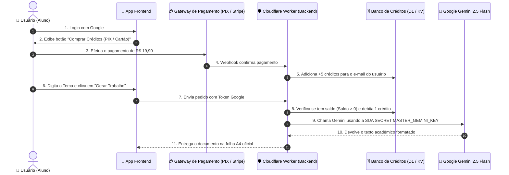

# 💎 Arquitetura Oficial SaaS do EMIA.EDU: Pagamento Pré-Pago + API Master Oculta

Este documento descreve a implementação do modelo comercial SaaS oficial onde o usuário **nunca precisa saber o que é uma API key**.

---

## 💰 1. A Matemática do Modelo de Negócio

| Métrica | Valor Real |
| :--- | :--- |
| **Preço Cobrado do Usuário** | R$ 19,90 (Pacote de 5 trabalhos ou plano mensal) |
| **Custo de IA do Google Gemini (por trabalho)** | ~R$ 0,008 (menos de 1 centavo por texto) |
| **Custo de IA para 5 trabalhos** | ~R$ 0,04 (4 centavos no total) |
| **Seu Lucro Líquido por Venda** | **R$ 19,86 (~99.7% de margem de lucro)** |
| **Risco Financeiro** | **Zero** (o usuário paga antes de gerar; você nunca gasta antecipado) |

---

## 🧱 2. Como Funciona a Arquitetura dos 4 Componentes



---

## ⚙️ 3. Configuração dos Componentes no Cloudflare

### A) Sua API Key Guardada como Segredo Seguro
Você define a sua chave no Cloudflare Worker como uma variável secreta criptografada (o usuário nunca tem acesso):
```bash
wrangler secret put MASTER_GEMINI_KEY
```

### B) Banco de Dados de Usuários e Créditos (Cloudflare D1 / KV)
Tabela simples no banco de dados:
```sql
CREATE TABLE users (
  email TEXT PRIMARY KEY,
  credits INTEGER DEFAULT 0,
  paid_total REAL DEFAULT 0.0,
  created_at TIMESTAMP DEFAULT CURRENT_TIMESTAMP
);
```

### C) O que o Usuário Vê no App:
1. **Entra com o Google** (1 clique).
2. **Visualiza seus créditos ou compra mais** (PIX / Cartão).
3. **Digita o tema e clica em "Gerar"**.
4. **Recebe o trabalho pronto** na folha A4 oficial da ABNT.

---

## 🚀 4. Vantagens Estratégicas Deste Modelo

1. **Simplicidade Absoluta:** Ninguém desiste no cadastro porque não precisa configurar chaves nem entender de tecnologia.
2. **Receita Recorrente:** Você cria pacotes de 1 trabalho (R$ 9,90), 5 trabalhos (R$ 29,90) ou Plano Ilimitado Mensal (R$ 39,90/mês).
3. **Escalabilidade Infinita:** O Cloudflare Workers suporta milhões de requisições por dia com latência inferior a 10ms.
